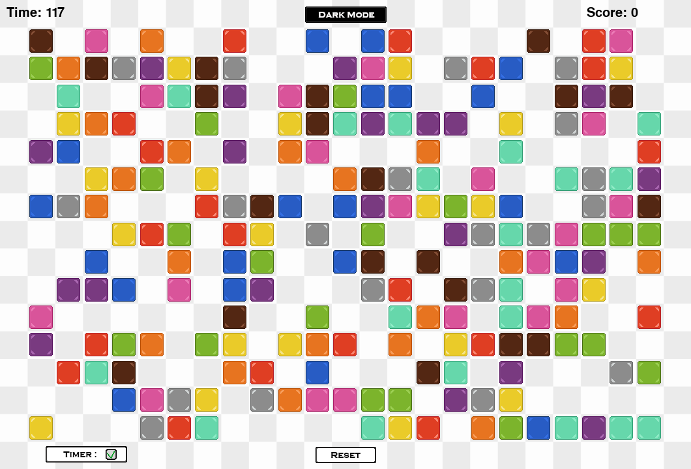

# Color-Tiles-pygame-project
"Color Tiles" 2D game made with Python

## Description
The goal of the game is to remove pairs of colored tiles by clicking on an empty spot on the board. If there are any matching colored tiles in any of the four directions (north, south, east, west), they get removed.
The player is presented with a certain amount of time (120 seconds) to match as many tiles as they can. If they make a wrong move (no matching tiles) the time gets deduced by 10 seconds. Each removed tile equals one point for the final score.

There are additional buttons for changing the settings:
- Theme - changes between "Light" and "Dark" mode
- Timer - turns the timer on or off (turning the timer back on after it has been stopped resets the score)
- Reset - resets the board, timer and score

When the timer reaches zero the player is presented with their final score and a button if they want to play again.

## Project resources
The game is done entirely on Python 3.10 with 2 additional modules:
- Pygame - [Documentation](https://www.pygame.org/docs/)
- cx_Freeze - [Documentation](https://cx-freeze.readthedocs.io/en/stable/index.html)

The images have been custom made.

Sounds used from:
- [Pixabay](https://pixabay.com/)
- [YouTube - Hyoshigi](https://www.youtube.com/watch?v=gPhgrab2OIg)

## Download the game in executable form
Link (zip file) - [Color Tiles v0.1](https://github.com/WolfeRTs/Color-Tiles-pygame-project/raw/main/executable/Color%20Tiles%20v0.1%20executable.zip)
